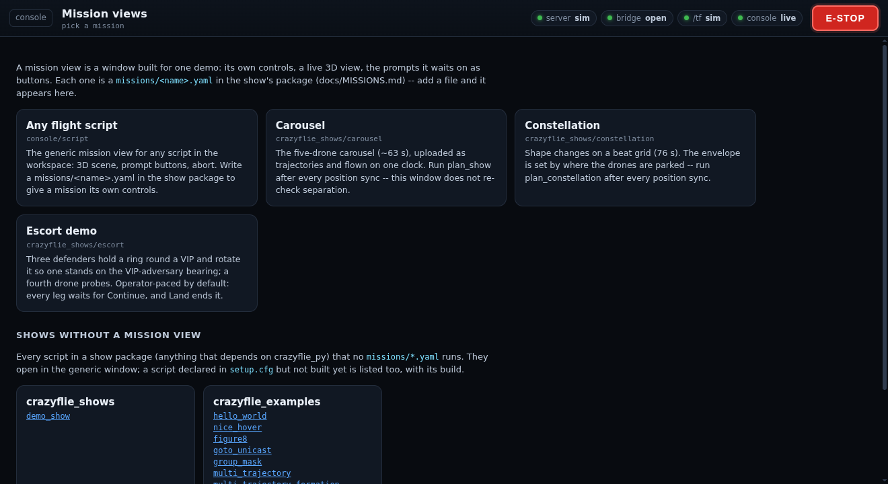
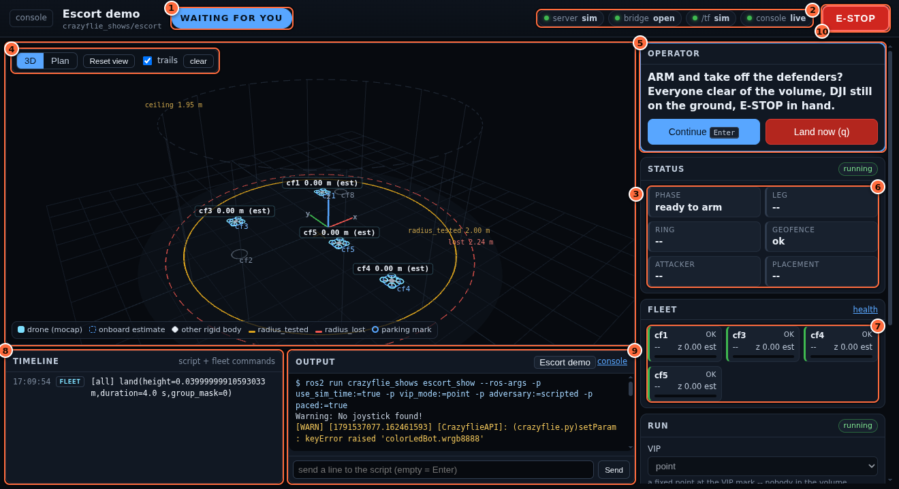
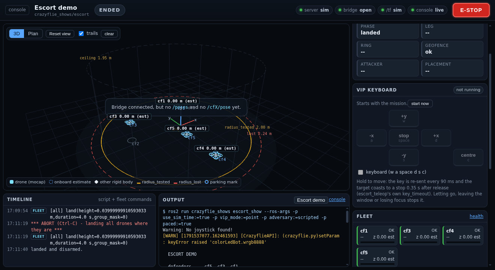
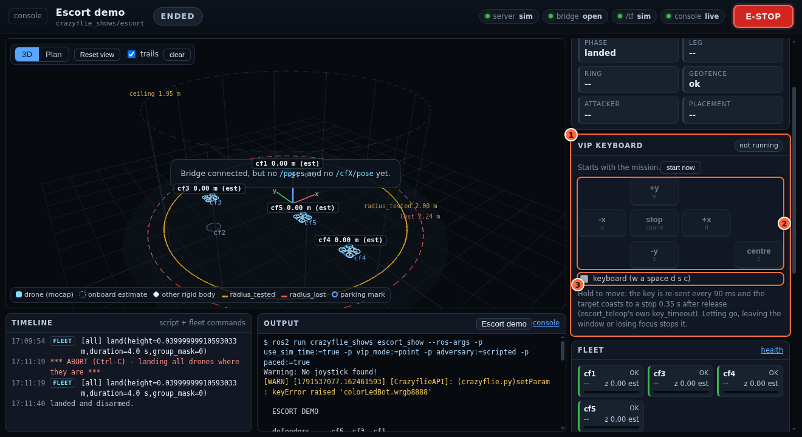
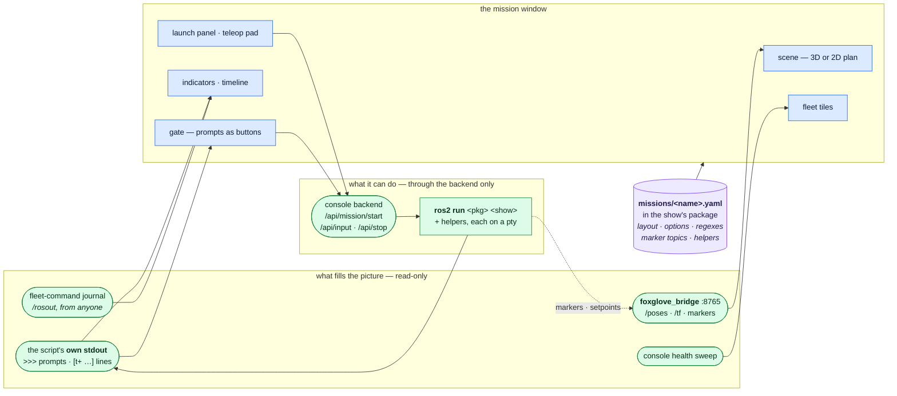
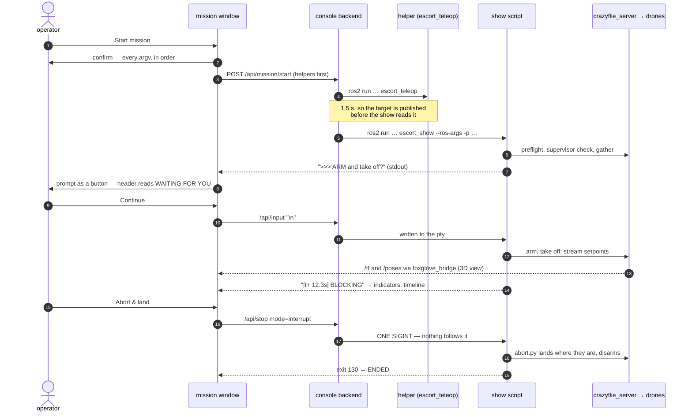

# Mission windows — a dashboard per demo, defined by the demo

The console (`console/`, [CONSOLE.md](CONSOLE.md)) is generic on purpose: every
action, every check, the same for every flight. A demo is not generic. The
escort needs a gate you answer at every leg and a VIP you steer; the next demo
will need something else. Editing the console for each one is how a tool turns
into a pile of special cases, so instead **each show ships a small YAML file
that describes its own window**, and the console renders it:

```
src/crazyswarm2/crazyflie_shows/missions/escort.yaml   ->  http://localhost:8077/mission?m=crazyflie_shows/escort
```

Open one from the console's **Dashboard → Missions** row (each opens its own
browser window), from the palette (`Ctrl-K`, type the mission name), or at
`/mission` for the list:

 A new `missions/<name>.yaml` appears there on the next
page load — no console change, no console restart, and with the workspace's
`--symlink-install` build no rebuild either.

Contents: [1 What a window gives you](#1-what-a-window-gives-you) ·
[2 Where the data comes from](#2-where-the-data-comes-from) ·
[3 The spec format](#3-the-spec-format) ·
[4 Writing one for a new demo](#4-writing-one-for-a-new-demo) ·
[5 Custom views](#5-custom-views-when-the-stock-widgets-are-not-enough) ·
[6 Safety contract](#6-the-safety-contract) ·
[7 Limits](#7-limits) · [8 What was verified](#8-what-was-verified)

---

## 1. What a window gives you



The escort, paced, stopped at its ARM gate (simulator backend):

| # | What it is |
|---|---|
| 1 | **The run state** — READY / RUNNING / **WAITING FOR YOU** / LANDING / ENDED, or RUNNING OUTSIDE THE CONSOLE when the census finds the show already running from a terminal. |
| 2 | **Link pills** — the server (and whether it is the simulator), the foxglove bridge behind the 3D view, the pose stream this window is receiving, and the console event stream. |
| 3 | **The scene** — the measured arena from `arena.yaml`, the parking marks from `crazyflies.yaml`, every drone with its trail and altitude, and the show's own markers. |
| 4 | **View controls** — 3D or Plan (x right, y up: the orientation of `plan_escort --plot` and of the teleop keys), reset, trails. |
| 5 | **The gate** — the script's own prompt, as buttons. `Enter` presses Continue; `q` lands. The panel glows and the header changes, so a waiting show is visible across the room. |
| 6 | **Indicators** — pulled out of the script's stdout by the spec's regexes. |
| 7 | **Fleet tiles** — supervisor state and battery from the console's health sweep, altitude from the live pose feed. |
| 8 | **The timeline** — the lines the spec calls events, interleaved with every fleet command the server acted on (tagged FLEET), wall-clock stamped to lay against a video. |
| 9 | **Raw output and a stdin line** — the script and each helper, on their own tabs. |
| 10 | **E-STOP** — the same one-click, answered e-stop as the console header. |

| Widget | What it shows / does |
|---|---|
| `scene` | Live 3D view (three.js): the measured arena from `arena.yaml` (radius_tested amber, radius_lost red, the ceiling as a cage), parking marks from `crazyflies.yaml`, every drone with a trail and altitude label, every other `/poses` rigid body (a VIP hat, an external adversary), and the show's own RViz markers. **3D** orbits; **Plan** is a top-down view with x right and y up — the orientation of `plan_escort --plot` and of the teleop keys. A drone drawn from its onboard estimate (no mocap, e.g. the simulator) is labelled `(est)`; with mocap, the estimate is a wireframe ghost and the fleet tile shows the estimate-vs-mocap error. |
| `gate` | When the script stops for the operator, its prompt becomes a big card with buttons (`Continue`, `Land now (q)`, ...). `Enter` presses the button marked `key: Enter`. A prompt printed without a newline (an `input()`) also shows, with a text box. |
| `indicators` | Status tiles pulled from the script's own output by regex: phase, leg, ring state, geofence... |
| `teleop` | An on-screen key pad (hold to move) plus an opt-in keyboard mode, driving a helper process such as `escort_teleop` — the same node, with the same clamps, as in a terminal. Can stay **locked** until the script prints a line (`enable_after`). |
| `fleet` | Per-drone tiles: supervisor state and battery from the console's health sweep, live altitude from the 3D feed. |
| `launch` | The operator's choices (from `options:`), the simulation-clock switch, the exact command line, Start / **Abort & land** / Kill, and the helper processes. |
| `events` | A timeline of the lines that matter (the spec's `events:` patterns), wall-clock stamped so they can be laid against a video. |
| `output` | Raw output of the script and each helper, with a stdin line. |

The header carries the run state, the link pills and the **E-STOP** — the same
one-click, answered-within-3-s e-stop as the console header.

**The launch panel** is where a run starts, and it is the only place the window
builds a command:



**1** the operator's choices, from the spec's `options:` (each one a stored
setting, shared with every other window on this console). **2** the exact
command line that will run — it updates as you choose, and the confirm step
shows it again. **3** Start, which becomes **Abort & land** and **Kill** while
the show runs. **4** the helper processes this choice implies, with their own
start/stop.

**The teleop pad** appears when a choice needs one (here VIP = `manual`), and
drives the same `escort_teleop` node a terminal would:



**1** the helper and whether it is running — it starts and stops with the
mission. **2** the pad: hold a key to move, release to stop. **3** the opt-in
keyboard mode, so the physical keys drive it; the pad stays **locked** until the
script prints the spec's `enable_after` line (for the escort, `ESCORT LIVE` —
the runbook's "start the teleop, then touch nothing until the show is live").

---

## 2. Where the data comes from

Nothing in the window is a second implementation of something the rig already
does — each panel is fed by whatever already knows the answer:




| What | Source | Why |
|---|---|---|
| 3D: drones, rigid bodies, markers | **foxglove_bridge** (`ws://<host>:8765`), which `launch.py` starts by default (`foxglove:=True`). The browser subscribes directly to `/poses`, `/tf`, `/cfX/pose` and the spec's marker topics. | A 3D view needs 50 Hz streams, not CLI calls. The bridge is already in the stack, so this adds no node and no rclpy to the console (the CLI-only rule stands for everything the console *does*). **Read-only**: the window never publishes or calls a service through it. |
| Starting, stopping, stdin | The console backend — the same `/api/input` and `/api/stop` as the Dashboard's output pane, plus `/api/mission/start` | Every command lands in the Command log (and the export script) and the usage log. |
| Gate, indicators, timeline | The script's **own stdout**, matched with the spec's regexes | The show is not modified to feed the window. Delete the spec and the show is byte-identical. |
| Fleet tiles | The console's health sweep (Server-Sent Events) | Same numbers as the Dashboard tiles. |

foxglove_bridge 3.x (the Rust SDK build in Humble/Jazzy apt) accepts only the
`foxglove.sdk.v1` WebSocket subprotocol; older bridges speak
`foxglove.websocket.v1`. The window offers both. Measured 2026-10-09 against
bridge 3.5.0. Override the URL with `?bridge=ws://host:port` on the window's URL.

The front-end libraries (Preact + htm, three.js) are **vendored** under
`console/mission_console/static/vendor/` and served by the console: the rig
flies on the Motive network, which has no internet, so a CDN import would leave
the window blank exactly when it is needed.

**A paced run, end to end.** The window never commands a drone itself: it starts
the same `ros2 run`, answers the same stdin, and sends the same single SIGINT
you would send with Ctrl-C.



---

## 3. The spec format

One YAML file per mission. Everything except `title` and `run` is optional. The
shipped specs — `crazyflie_shows/missions/escort.yaml` (gates, two teleop
helpers, markers), `carousel.yaml` and `constellation.yaml` (no gates, phase
indicators) — are the worked examples.

```yaml
mission: 1                      # spec version; the console refuses others
title: Escort demo
summary: >                      # shown on the mission card
  One paragraph: what it is, what to check first.
docs: runbooks/ESCORT.runcard.md   # shown as a pointer, nothing reads it
run: escort_show                # executable in THIS package, or "pkg exe"
flight: true                    # moves drones -> confirm step shows the commands
abort: sigint                   # how "Abort & land" ends it: sigint | q

options:                        # the operator's choices, each becomes -p name:=value
  - name: vip_mode              # ROS parameter name (or set `param:` to differ)
    label: VIP
    choices:                    # a select; a mapping gives each choice a description
      point: a fixed point at the mark
      manual: a point you steer
    default: point
  - name: paced
    type: bool                  # select | bool | number | text
    default: true
  - name: dry_run
    type: bool
    default: false
    omit_default: true          # leave it off the command line while it is the default
  - name: vip_name
    type: text
    default: operator
    when: {vip_mode: mocap}     # only shown, and only passed, when this holds

helpers:                        # extra processes that go with the mission
  vip_keys:
    label: VIP keyboard
    run: escort_teleop
    params: {target: vip}       # fixed -p values
    when: {vip_mode: manual}    # only offered when this holds
    autostart: true             # started (1.5 s) before the main script
    teleop: planar              # key pad: planar (wasd, space, c) | spatial (+ q/e)
                                # | a list of {label, key, kbd, cell: [col,row], hold}
    enable_after: 'ESCORT LIVE' # pad locked until the main script prints this

topics:
  markers: [/escort/markers]    # visualization_msgs/MarkerArray topics to draw

gate:                           # `gate: false` for a show that never waits
  prompt: '^\s*>>>\s*(?P<text>.+)$'   # a line that opens a gate; group `text` is shown
  until: '\[q\]\s*land'         # the line that ends the prompt block (lines between = details)
  partial: '(\?|:|>)\s*$'       # an unterminated line that counts as a prompt
  buttons:
    - {label: Continue, send: '', key: Enter, tone: primary}   # send = the line written to stdin
    - {label: Land now (q), send: q, tone: danger}

indicators:                     # several rules may share a label; the latest match wins
  - {label: Phase, match: 'ESCORT LIVE', value: LIVE, tone: {LIVE: ok}, initial: idle}
  - {label: Leg, match: '>>> leg (\d+/\d+) (STARTED|COMPLETE)', value: '$1 $2'}
  - {label: Figure, match: '\[t\+\s*[\d.]+s\]\s*(?P<fig>.+)$', value: '$fig'}

events: ['\[t\+', 'GEOFENCE', '\*\*\*']   # lines that get a timeline row

layout:                         # which widgets, where. Defaults shown.
  main: [scene]
  side: [gate, indicators, teleop, fleet, launch]   # teleop:vip_keys = just that helper
  bottom: [events, output]
view: escort_view.mjs           # optional custom module next to the spec (section 5)
```

**Regexes.** The patterns run in the browser (JavaScript), and are validated by
the console (Python) when the spec loads. Write named groups either way —
`(?P<name>...)` or `(?<name>...)` — the console translates. A **leading** `(?i)`
is allowed (case-insensitive); any other inline flag is refused, because
JavaScript has none. A spec that does not validate is listed with its error
rather than silently dropped.

**Values the operator picks are validated** against the spec before anything
runs: a select must be one of its choices, a number must parse, a text value may
not contain spaces, and the free-form "more ROS parameters" field must be
`name:=value` pairs. `ros2 run` silently ignores a misspelled parameter and flies
the default, so a typo is refused instead.

**The simulation clock** is not an option you declare: every mission window has
it, defaulting to whatever the running stack is (`/clock` present = sim), and it
adds `use_sim_time:=true` to the main script **and every helper**.

---

## 4. Writing one for a new demo

1. **Make the script say what is happening.** The window can only show what the
   script prints. Print a distinctive line at each phase change (`SHOW START`,
   `ESCORT LIVE`), prefix timeline-worthy events (`[t+ 12.3s] ...`), and if the
   operator must decide something, print a prompt line that starts with `>>>` and
   read a **line** from stdin (see `escort_show.operator_gate` — `select()` on
   stdin while the control loop keeps running). No other coupling is needed.
2. **Make it land on SIGINT.** Use `crazyflie_shows/abort.py`
   (`take_signals()` + `abort_land()`) — "Abort & land" sends exactly one SIGINT
   and nothing after it. Without it, use `abort: q` and handle a `q` line.
3. **Write `missions/<name>.yaml`** in the package (`run:`, `options:` for the
   parameters an operator actually changes, the `gate:` if it waits,
   `indicators:` and `events:` for its output). Open `/mission`: a broken spec
   shows its error on the card.
4. **Rehearse it in sim** (`backend:=sim`, the window's simulation clock on):
   press every gate button, try Abort & land at a gate *and* mid-flight.
5. For a non-symlink install, `missions/` must be installed:
   `install(DIRECTORY missions DESTINATION share/${PROJECT_NAME}/)` in the
   package's `CMakeLists.txt` (`crazyflie_shows` has it).

Any package that depends on `crazyflie_py` is scanned, the same as for flight
scripts.

**Is it built?** A new show is easy to half-build: colcon's `--symlink-install`
makes *edits* to an existing module live, so it is natural to forget that a new
**package**, a new **script in `setup.cfg`** or a new **module file** only exists
after `./scripts/build.sh <pkg>` — and then `ros2 run` says "No executable
found" or the script dies with `ModuleNotFoundError`. The console compares every
show package in `src/` with `install/` (`console/mission_console/builds.py`;
file checks only, nothing is imported) and says so in four places:

* **System health → Show packages built** — so it appears under *needs
  attention* the moment you declare a script you have not built;
* the Dashboard's **mission chips** carry a *not built* badge;
* the **mission window** replaces Start with what is missing and a **Build
  <pkg>** button (the console's own `./scripts/build.sh <pkg>` action, logged
  like any other); Start is refused by the backend too;
* the **mission list** (`/mission`) has a section **Shows without a mission
  view** — every script in a show package that no spec runs, built or not, each
  opening the generic window — so a new show is visible before anyone writes a
  spec for it.

A new module blocks only the scripts that need it (the script's same-package
imports, followed with `ast`). A package that was built *after the console
started* is reported separately: it is not on the console's
`AMENT_PREFIX_PATH`, so restart `./console/run.sh`. Verified 2026-10-09 with a
throwaway show: declared → flagged everywhere → Build button → runnable → run
with its `>>>` prompt answered from the window. And every script — including one with no spec — can run in the built-in
**Any flight script** window (`/mission?m=console/script`), which has the 3D view,
the generic `>>>` gate and the abort.

---

## 5. Custom views (when the stock widgets are not enough)

`view: <file>.mjs` names an ES module next to the spec. The window imports it
from `/mission-assets/<pkg>/<name>/<file>` (path-checked to that directory) and
uses what it exports:

```js
// missions/my_demo_view.mjs
export const widgets = {
  // a new widget, usable in `layout:` as `scoreboard`
  scoreboard: ({ ctx }) => {
    const { html, useStore, procFor } = ctx;
    const s = useStore();                 // re-renders on every console/bridge event
    const main = procFor('main');         // newest run of the main script
    const lines = (main && s.lines.get(main.id)) || [];
    const hits = lines.filter((l) => /BLOCK/.test(l.text)).length;
    return html`<section class="panel"><div class="pb">blocks: <b>${hits}</b></div></section>`;
  },
};
// optional: `export default ({ ctx }) => ...` replaces the whole layout;
// ctx.W holds every widget (stock + yours) to compose with.
```

`ctx` carries `html`/`h` and the Preact hooks, `useStore()` and `store`,
`procFor(role)`, `sendLine(procId, text)`, `startRole(role, values, sim)`,
`post(path, body)`, `bridge()` (subscribe to any topic:
`ctx.bridge().subscribe('/topic', (msg) => ...)` — read-only) and `facts()`
(the health sweep's facts). `window.__scene` is the 3D scene
(`setMarkers`, `setPose`, `bodies()`, ...) for drawing your own objects.

Keep a custom view to *showing* things. Anything that commands drones belongs in
the script, where it can be planned and refused.

---

## 5b. One source of truth

* **The same run, wherever it was started.** If the mission's script is
  already running — started from the Dashboard's **Fly**, say — the window
  *adopts* it: its prompts, status, output and Abort & land are here, with a
  note saying where it was started. If it runs **outside the console** (a
  terminal), the census sees it: the header reads RUNNING OUTSIDE THE CONSOLE,
  Start is disabled, the 3D view is live, and Stop / Kill signal it — but its
  output went to its terminal, so there are no prompts or status tiles.
* **Choices are the console's settings**, under `mission.<id>.<option>`, not
  this browser's: open the window elsewhere and it shows the same choices; the
  backend applies them even to a request that left them out.
* **The timeline also carries every fleet command** the server acted on while
  the window was open, from anyone (tagged FLEET), and an e-stop from anywhere
  raises the banner — including the simulator's "not yet implemented", which
  the banner calls out: in sim, e-stop does nothing.

## 6. The safety contract

The window keeps the console's rules, and adds two of its own.

* **Nothing moves a drone without a confirm step that shows every command line**
  (helpers first, then the script). The step also warns when the server is down,
  when the simulation clock disagrees with the running stack, and when there is
  no bridge.
* **One flight script at a time.** Starting a mission's main script is refused
  while another flight script — a Dashboard "Fly" run or another mission — is
  running. Two scripts commanding the same drones fight each other.
* **E-STOP is one click with an answer**, the same `/api/estop` as the console.
* **Abort & land is ONE SIGINT, with no escalation.** The Dashboard output
  pane's Stop sends SIGINT, then SIGTERM 6 s later, then SIGKILL. `abort.py` restores
  the default handlers once its landing starts, so that SIGTERM would kill a
  landing that runs long. Abort sends the SIGINT and nothing else: the show lands
  itself, the button reads *Landing...*, and **Kill** is a separate,
  confirmed button for a script that is truly stuck.
* **Helpers stop when the main script ends**, and a held teleop key is released
  when the window loses focus or is hidden — the target coasts to a stop within
  `escort_teleop`'s 0.35 s `key_timeout`. A teleop pad can be locked until a
  named line appears (the escort runcard: *touch nothing until ESCORT LIVE*).
* It is **not a safety layer** any more than the console is: the refusals that
  matter live in the shows, the planners and `preflight.py`. Run the planner
  after every position sync.

---

## 7. Limits

* **No WebGL → a 2D plan view.** This laptop is an NVIDIA Optimus hybrid and
  Chrome can fail to create a WebGL context on it (`BindToCurrentSequence
  failed ... Optimus = yes`, reproduced 2026-10-09). The first version then lost
  its 3D view **and its Start button**: three.js threw inside a Preact effect,
  the effect queue stopped, and the confirm dialog never appeared. Now the scene
  falls back to `plan2d.mjs` (same data, same API, plan view, altitude in the
  labels, wheel to zoom, drag to pan) and says so in the corner, and every
  widget sits behind an error boundary — one failing panel shows its error and
  the rest of the window keeps working. If you want the 3D view back, check
  `chrome://gpu`.
* **No 3D without foxglove_bridge.** The window says so in the scene and the
  header pill; everything else works. The flight is unaffected.
* **Reaching the window from another machine** needs port 8765 as well as 8077
  (the browser talks to the bridge directly) — tunnel both
  (`ssh -L 8077:localhost:8077 -L 8765:localhost:8765 <rig>`), or pass
  `?bridge=` a reachable URL. Same no-authentication warning as the console.
* **Lines, not keystrokes, for gates.** A gate writes a line (`text + "\n"`) to
  the script's pty. Teleop keys are written without a newline, one per press and
  every 90 ms while held, which is what `escort_teleop`'s raw-mode reader expects.
  A script that reads `/dev/tty` directly, or `sudo`, is still a terminal job,
  and so is a gamepad (`teleop_xbox`).
* **Markers drawn:** ARROW, CUBE, SPHERE, CYLINDER, LINE_STRIP, LINE_LIST,
  CUBE_LIST, SPHERE_LIST, POINTS, TEXT_VIEW_FACING, with DELETE/DELETEALL and
  lifetime. MESH_RESOURCE and TRIANGLE_LIST are skipped. Every marker is assumed
  to be in the `world` frame (true for everything in this repo); `/tf` is used
  only for the drones themselves.
* **Indicators are only as good as the script's output.** A rephrased print
  silently stops matching. Keep the spec next to the code it parses, and change
  them in the same commit.

---

## 8. What was verified

On 2026-10-09, simulator backend, private `ROS_DOMAIN_ID`, driven through the
window in headless Chrome:

* **Escort**, `vip_mode:=manual`, `adversary:=scripted`, `paced:=true`: the VIP
  keyboard helper autostarted before the show and the show found its target;
  every gate (ARM, begin, leg 1/3 COMPLETE, leg 2/3 STARTED, leg 3/3 STARTED) was
  answered with the Continue button (a bare Enter); Phase / Leg / Ring tracked
  the output (LIVE, 2/3 STARTED, BLOCKING); the pad stayed locked until
  `ESCORT LIVE`, then the keyboard drove the VIP (the show reported it moving at
  0.32 m/s); the show's `/escort/markers` drew; **Abort & land** mid-flight
  landed through `abort.py` (Phase = landed, 19 s) and the helper stopped.
* **SIGINT at the paced ARM gate** aborts cleanly (exit 130). It did NOT before
  this change — see the `ShowAborted` entry in CLAUDE.md.
* **Any flight script** with `hello_world`: flew to 0.43 m and ended; drones
  drawn from `/tf` in the plan view.
* **Carousel** dry run: Phase = dry run OK.

**Not verified on hardware.** Mocap-driven drawing (`/poses`), the estimate
ghost and the estimate-vs-mocap error have been exercised only by reading the
code path, not with real drones; check them against RViz on the first hardware
run.
